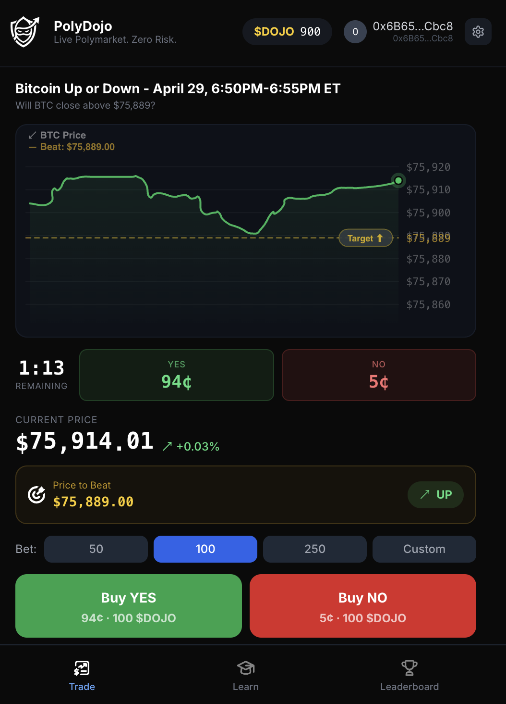

<p align="center">
  
</p>

<h1 align="center">PolyDojo</h1>

<p align="center"><strong>Live Polymarket. Zero risk. Real onchain rewards.</strong></p>

<p align="center">
  <a href="https://www.polydojo.app/"><strong>polydojo.app →</strong></a>
</p>

<p align="center">
  
</p>

> **Status: BETA.** PolyDojo is actively under development. Some features are still in progress, and parts of the app may misbehave or change without notice. Onchain state lives on Base Sepolia (testnet) and may be reset between releases. Don't treat anything in this app as a financial product.

PolyDojo is a prediction-market trading simulator that mirrors live Polymarket BTC odds in 5-minute rounds, lets users trade freely with no real money, and settles every round onchain on Base — minting winners' $DOJO and burning losers' in a single batch transaction. After every round, an AI coach reviews the user's actual trades.

Built for **Base Batches #3 — Student Track**.

---

## Table of Contents

- [The Problem](#the-problem)
- [The Solution](#the-solution)
- [How It Works](#how-it-works)
- [Tech Stack](#tech-stack)
- [Smart Contracts](#smart-contracts)
- [The $DOJO Token](#the-dojo-token)
- [Project Structure](#project-structure)
- [Local Development](#local-development)
- [Environment Variables](#environment-variables)
- [Database](#database)
- [Deployment](#deployment)
- [Built for Base Batches #3](#built-for-base-batches-3)

---

## The Problem

There is a massive gap between *curious about Polymarket* and *willing to deposit real money on Polymarket*. Existing alternatives don't bridge it:

- **Polymarket itself** has no on-ramp, no training wheels, no way to learn without losing money.
- **Paper-trading apps** are disconnected from real markets and have no skin in the game — wins don't matter, so neither does the practice.
- **Generic crypto sims** use synthetic prices, so the market behavior you learn isn't the market behavior you'll trade.

The result: most prediction-market-curious users either deposit money cold and get rekt, or never deposit at all. Polymarket loses the funnel and beginners lose money learning lessons they could have learned for free.

## The Solution

PolyDojo is a free-to-play, mobile-first practice arena that uses the **same odds, the same threshold, and the same fixed-odds-at-entry math as real Polymarket**, but pays out in $DOJO — an onchain reward token with no monetary value. Users build a real onchain track record (badges, leaderboard rank, P&L history) before risking a single dollar of real money.

Specifically:

- **Live odds.** The frontend pulls Polymarket's Gamma + CLOB APIs every two seconds, so you're trading against the same prices a real Polymarket user would see.
- **Same threshold.** The "above $X at 8:25 PM" line on screen is the Coinbase 1-min candle open at window start — exactly what Polymarket's question text uses — and it's the same number the smart contract settles against. No screen-vs-chain divergence.
- **Same math.** Profit = stake × (1 − entryProb) / entryProb, computed at entry time and frozen for that bet. Identical to a Polymarket share.
- **Onchain rewards.** Wins mint $DOJO directly to your wallet. Lose enough and your wallet hits zero — collect a Bankrupt badge and call `claimRefill` for a one-time top-up. Earn enough and unlock Trader → Shark → Whale → Legend tier badges.
- **AI coach.** A per-round critique of your actual trades — entry timing, sizing, momentum reads, contrarian moves — turns every loss into a lesson.

## How It Works

The core architectural decision is the **hybrid off-chain / onchain model**:

```
  ┌─────────────────────── 5-min round window ────────────────────────┐
  │                                                                    │
  │  ┌─ off-chain (Supabase) ────────────────────────────────────────┐ │
  │  │  user buys, sells, flips sides, averages in                   │ │
  │  │  → instant UX, no gas, no signatures, no wallet popups        │ │
  │  │  → bets table mutates freely; realized P&L tracked per row    │ │
  │  └───────────────────────────────────────────────────────────────┘ │
  │                                                                    │
  │  ┌─ at round end ─ (Chainlink price + computed deltas) ──────────┐ │
  │  │  GameManager.settleRound(roundId, price, users[], deltas[])   │ │
  │  │  → atomic mint winners' $DOJO + burn losers' in one tx        │ │
  │  │  → bets rows flipped settled=true, displayed balance updates  │ │
  │  └───────────────────────────────────────────────────────────────┘ │
  └────────────────────────────────────────────────────────────────────┘
```

Why this matters:

- **UX of a free game** — buy/sell during the round is a Supabase upsert, not an EVM transaction. No paymaster gas spend per trade, no popup fatigue.
- **Truth of an onchain ledger** — once the round closes, the result is a single, atomic, public mint/burn. The user's wallet, badges, and history are all real onchain state. They could uninstall the app and still own everything.
- **Server-trustable but cheap to verify** — Supabase is the source of truth during the round, but the deltas posted to `settleRound` are publicly verifiable against the on-chain Chainlink price and the published threshold.

A cron-style API endpoint (`/api/rounds/resolve`) is poked from the client at round end and runs the settlement loop. Each round goes through these stages:

1. **Window starts** → `/api/rounds/ensure` calls `GameManager.createRound(roundId, threshold)` once. Threshold is the Coinbase 1-min candle open at window start, scaled to Chainlink's 8 decimals so it can be compared directly to `latestRoundData()` at settlement.
2. **During the round** → Frontend polls `/api/positions` every 3s for pool stats and the user's open bet; trades are POSTs to the same route. Sells mark-to-market the user's stake at the current Polymarket odds and bank the P&L into a `realized_wei` column.
3. **Window ends** → Frontend pokes `/api/rounds/resolve`. Backend reads the latest Chainlink BTC/USD price, computes `delta = realized_wei + fixedOddsPayout(amount, entry_odds_bps)` per user, simulates the call to surface revert reasons cleanly, then sends one `settleRound` tx that mints winners and burns losers.
4. **Post-settlement** → Bet rows flagged `settled=true`, header balance refetches from chain, AI coach summarizes the trades.

## Tech Stack

**Frontend**
- Next.js 14 (App Router), React 18, TypeScript
- TailwindCSS
- TanStack Query for server-state caching
- viem + wagmi v2 for chain reads
- Coinbase OnchainKit + MiniKit for wallet/identity UI
- lightweight-charts for the BTC price chart

**Wallet & UX**
- Coinbase Smart Wallet (ERC-4337) — seedphrase-free, one-tap onboarding
- CDP Paymaster — gasless first-mint and badge claims
- Farcaster Frames + Frame SDK — entry point inside Warpcast
- Base App mini app — primary distribution surface

**Backend**
- Next.js Route Handlers (Node runtime) on Vercel
- Supabase Postgres (Row Level Security, service-role admin client)
- JWT-based session auth (jose)

**Onchain**
- Solidity 0.8.20, OpenZeppelin contracts (ERC-20, ERC-1155, Ownable)
- Base Sepolia (today) → Base mainnet (at launch)
- Chainlink BTC/USD oracle for settlement price

**External data**
- Polymarket Gamma + CLOB APIs (live odds, market metadata)
- Coinbase Exchange 1-min candles (threshold source — matches Polymarket's question text)

**AI**
- Server-side route that summarizes per-round trade history into a personalized review

## Smart Contracts

Four contracts on Base Sepolia, all wired together at deploy time so GameManager has minter rights on DojoToken and Achievements.

### DojoToken (`contracts/DojoToken.sol`)

ERC-20 representing in-game currency. A minter allowlist gates `mint` and `burn`, owned by the deployer. The deploy script authorizes GameManager as a minter; the settlement loop also has a pre-flight check that re-authorizes if the bit was lost.

| | |
|---|---|
| Name / Symbol | PolyDojo / DOJO |
| Decimals | 18 |
| Supply | Unbounded (minter-gated) |
| Address (Base Sepolia) | `0xc9c7a45b780b58414a47675e70a25c190f7bf715` |

### GameManager (`contracts/GameManager.sol`)

The orchestrator. Stores rounds, accepts off-chain-computed deltas, and emits per-user settlement events.

Key functions:
- `firstMint(user)` — one-time 1000 DOJO welcome bonus, gated to onlyOwner.
- `createRound(roundId, threshold)` — registers a new 5-min window. `roundId` is the unix timestamp of the window start.
- `settleRound(roundId, chainlinkPrice, users[], deltas[])` — applies signed deltas: positive mints, negative burns (capped at the user's current balance so a bankrupt user just zeros out cleanly). Emits `RoundSettled` and per-user `SettlementApplied` events.
- `claimRefill()` — one-time 500 DOJO top-up for any user whose balance hits zero, also mints a Bankrupt badge.

| | |
|---|---|
| INITIAL_MINT | 1000 ether |
| REFILL_AMOUNT | 500 ether |
| Address (Base Sepolia) | `0x7ce874264882845844154984430e4b8ea58ec0b2` |

### Achievements (`contracts/Achievements.sol`)

ERC-1155 badges tied to gameplay milestones. Token IDs:

| ID | Badge |
|---|---|
| 1 | Trader |
| 2 | Shark |
| 3 | Whale |
| 4 | Legend |
| 5 | Bankrupt |
| 10 | Streak 3 |
| 11 | Streak 5 |
| 12 | Streak 10 |
| 20–24 | Scenario Master tiers |
| 30 | Perfect Round |
| 31 | Contrarian Win |

Address (Base Sepolia): `0x8b3350e03d02765ea53745ef1a08628399c94bb1`

### Leaderboard (`contracts/Leaderboard.sol`)

Append-only score store with a `getTopPlayers()` view. Updated by GameManager after settlement.

Address (Base Sepolia): `0xf7f17318da666927364564e02ac801f934c624a4`

### Chainlink BTC/USD Aggregator

Used as the resolution oracle. Read via `latestRoundData()` at settlement; compared against the round's stored threshold. Both are scaled to 8 decimals.

## The $DOJO Token

$DOJO is the in-game currency. It exists onchain as a real ERC-20 — visible in any wallet, transferable between addresses — but is not sold, not raised against, and is not intended to have monetary value. Its role is to make the practice arena's outcomes *real* — your wallet balance, your wins, your losses, your achievements all live in the same place a real Polymarket trader's would.

| | |
|---|---|
| Name | PolyDojo |
| Symbol | DOJO |
| Decimals | 18 |
| Original network | Base Sepolia |
| Mainnet target | Base mainnet (at public launch) |
| Address (Sepolia) | `0xc9c7a45b780b58414a47675e70a25c190f7bf715` |

## Project Structure

```
polydojo/
├── app/                        # Next.js App Router
│   ├── api/                    # Route handlers
│   │   ├── ai/{review,tip}     # AI coach endpoints
│   │   ├── auth/               # SIWE / Farcaster sign-in
│   │   ├── leaderboard/        # Top-N read
│   │   ├── polymarket/         # Live odds proxy (Gamma + CLOB)
│   │   ├── positions/          # Off-chain bet ledger CRUD
│   │   ├── rounds/             # createRound + settleRound triggers
│   │   ├── users/              # Player stats
│   │   └── webhook/            # Notification hooks
│   ├── layout.tsx
│   └── page.tsx
├── components/
│   ├── App/                    # Top-level shell
│   ├── market/                 # Chart, odds, position card, recap
│   ├── tabs/                   # Trade / Leaderboard / Profile / Learn
│   ├── shared/                 # Header, balance display
│   └── ...
├── contracts/                  # Solidity sources
│   ├── DojoToken.sol
│   ├── GameManager.sol
│   ├── Achievements.sol
│   └── Leaderboard.sol
├── hooks/
│   ├── use-market.ts           # Polymarket polling + round state machine
│   ├── use-position.ts         # Off-chain bet read/write + 3s polling
│   ├── use-dojo-balance.ts     # Onchain balance polling
│   ├── use-btc-price.ts        # Live BTC ticker
│   └── ...
├── lib/
│   ├── chain.ts                # viem clients + window utilities
│   ├── contracts.ts            # ABIs + addresses
│   ├── rounds.ts               # ensureCurrentRound + resolveDueRounds
│   ├── odds.ts                 # Fixed-odds-at-entry math
│   ├── supabase.ts             # Supabase admin/anon clients
│   └── ...
├── scripts/
│   ├── compile.js              # solc compile
│   ├── deploy.js               # deploys all 4 contracts + wires permissions
│   └── mint-dojo.js            # admin mint helper
└── supabase/
    ├── 003_onchain_tables.sql  # bets + onchain_rounds tables
    ├── 004_positions.sql       # mutable-positions migration
    └── 005_realized.sql        # realized P&L column
```

## Local Development

Prerequisites: **Node 22.x**, a Supabase project, a Base Sepolia RPC (default works), and a funded deployer key.

```bash
# 1. Install
yarn

# 2. Configure env
cp .env.example .env.local
# fill in DEPLOYER_PRIVATE_KEY, Supabase keys, Polymarket/Coinbase nothing-required, etc.

# 3. Compile + deploy contracts (one-time)
node scripts/compile.js
node scripts/deploy.js
# copy the four printed addresses into .env.local

# 4. Apply database migrations
# (in Supabase SQL editor, run files under supabase/ in order)

# 5. Run the dev server
yarn dev          # filtered access logs (recommended)
yarn dev:raw      # raw next dev with all access logs

# 6. Optional: mint DOJO to a test wallet
node scripts/mint-dojo.js 0xYourAddress 1000
```

The app runs on `http://localhost:3000`. Trading works fully against Base Sepolia; first-time wallets get a `firstMint` of 1000 DOJO automatically.

## Environment Variables

| Key | Purpose |
|---|---|
| `JWT_SECRET` | Session JWTs |
| `NEXT_PUBLIC_URL` | Public app origin |
| `NEXT_PUBLIC_MINIKIT_PROJECT_ID` | OnchainKit project ID |
| `NEXT_PUBLIC_FARCASTER_HEADER` | Farcaster Frame manifest |
| `NEXT_PUBLIC_FARCASTER_PAYLOAD` | Farcaster Frame manifest |
| `NEXT_PUBLIC_FARCASTER_SIGNATURE` | Farcaster Frame manifest |
| `NEXT_PUBLIC_SUPABASE_URL` | Supabase project URL |
| `NEXT_PUBLIC_SUPABASE_ANON_KEY` | Public anon key |
| `SUPABASE_SERVICE_ROLE_KEY` | Server-side admin key |
| `DEPLOYER_PRIVATE_KEY` | Owner of GameManager + DojoToken |
| `NEXT_PUBLIC_DOJO_TOKEN_ADDRESS` | DojoToken address |
| `NEXT_PUBLIC_GAME_MANAGER_ADDRESS` | GameManager address |
| `NEXT_PUBLIC_ACHIEVEMENTS_ADDRESS` | Achievements address |
| `NEXT_PUBLIC_LEADERBOARD_ADDRESS` | Leaderboard address |
| `NEXT_PUBLIC_CHAINLINK_BTC_USD` | Chainlink aggregator (Base Sepolia) |
| `NEXT_PUBLIC_CDP_PAYMASTER_URL` | Coinbase Developer Platform paymaster |

## Database

Two main Supabase tables (full schema in `supabase/003_onchain_tables.sql`):

**`onchain_rounds`** — registry of every 5-min window.

| Column | Type | Notes |
|---|---|---|
| `round_id` | bigint PK | Unix timestamp of window start |
| `threshold` | numeric(78,0) | Chainlink-scaled (8 dec) |
| `end_time` | bigint | Unix seconds |
| `resolution_price` | numeric(78,0) | Filled at settlement |
| `yes_wins` | bool | Filled at settlement |
| `resolved` | bool | |
| `created_tx`, `resolved_tx` | text | Tx hashes |

**`bets`** — one row per user-round, mutated freely during the round.

| Column | Type | Notes |
|---|---|---|
| `user_address` | text | |
| `round_id` | bigint FK | |
| `is_yes` | bool | Side currently held |
| `amount` | numeric(78,0) | DOJO wei locked in open position |
| `entry_odds_bps` | int | Polymarket odds at entry, in bps |
| `realized_wei` | numeric(78,0) | Banked P&L from mid-round sells (signed) |
| `settled` | bool | True once `settleRound` succeeds |
| `settled_delta` | numeric(78,0) | Delta minted/burned at settlement |
| `placed_at`, `updated_at` | timestamptz | |

`UNIQUE(user_address, round_id)` so the same user can flip sides without creating ghost rows; `idx_bets_round_unsettled` is a partial index speeding up the cron's "find due bets" query.

## Deployment

- **Frontend / API** — Vercel, automatic on push to `main`.
- **Contracts** — `node scripts/deploy.js` from a funded Base Sepolia key. The script deploys DojoToken → Achievements → Leaderboard → GameManager (in that order so GameManager's constructor receives the others' addresses), then wires GameManager as a minter on both DojoToken and Achievements.
- **Distribution** — Base App mini app (primary), Farcaster Frame, and standalone web at the public URL.

## Built for Base Batches #3

PolyDojo was created as a submission to **Base Batches #3 — Student Track**.

Why Base specifically:

- **Base App mini app distribution** — primary surface for getting users into the product without an install or seedphrase.
- **Coinbase Smart Wallet + CDP Paymaster** — first-time users get a wallet and a gasless first-mint without ever touching ETH or a recovery phrase. This is the difference between a 30-second and a 30-minute onboarding for a non-crypto-native player.
- **Per-round onchain settlement is economically viable on Base** — the gas profile of mint+burn for N users in a single tx is small enough to absorb without paywalling the experience.
- **OnchainKit + Farcaster Frame integrations** — give us additional discovery surfaces and identity primitives that compose cleanly with the Smart Wallet flow.

The contracts and frontend would technically port to any EVM chain, but the *product* — a free-to-play, mobile-first prediction-market trainer with onchain rewards — only works because Base provides the full distribution + onboarding + low-fee stack in one place.
